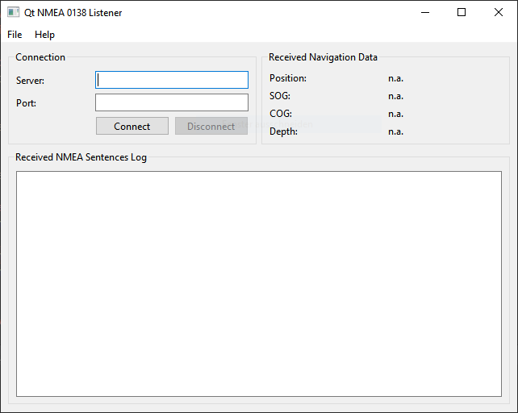

# QtWidgetsProgrammatically

In this project, I built a (currently) non-functional user interface with Qt widgets which could be used for the [NMEA 0138 Listener](../nmea0138-listener/README.md) I started building previously.

